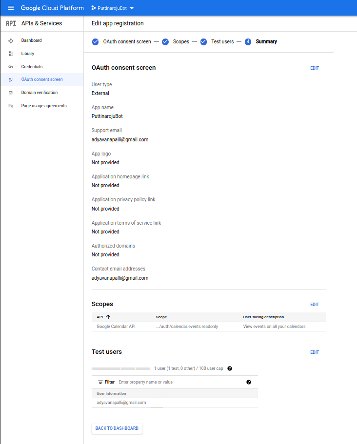
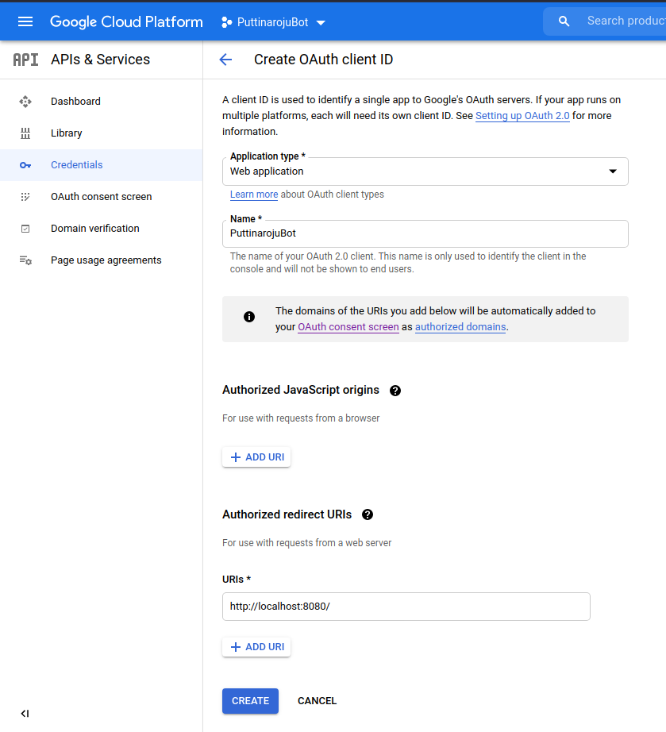

# RPi Google Calendar

A proof of concept for accessing the Google Calendar API from a Raspberry Pi.

## Prerequisites

You will need to register the OAuth client on Google's end before initiating the
OAuth flow.

### OAuth Client Configuration

An OAuth client must be registered in Google's Cloud console before a client
initiates an OAuth flow.

#### OAuth Consent Screen

The OAuth consent screen configures what is displayed to the client during an
authorization flow. Here is an example from an application I've previously
configured:

If the application will not be published, you will need to manually add all the
users that will be authorized via an OAuth flow to the list of test users.

#### OAuth Client ID

After configuring the OAuth consent screen, you will need to create an OAuth
client ID. Here is an example from an application I've previously created one
for:

Note the values of the **Application type** and **Authorized redirect URIs**.

#### OAuth Client Secret

After an OAuth client ID has been generated, download the client secret to this
repository's root directory as `client_secret.json`.
